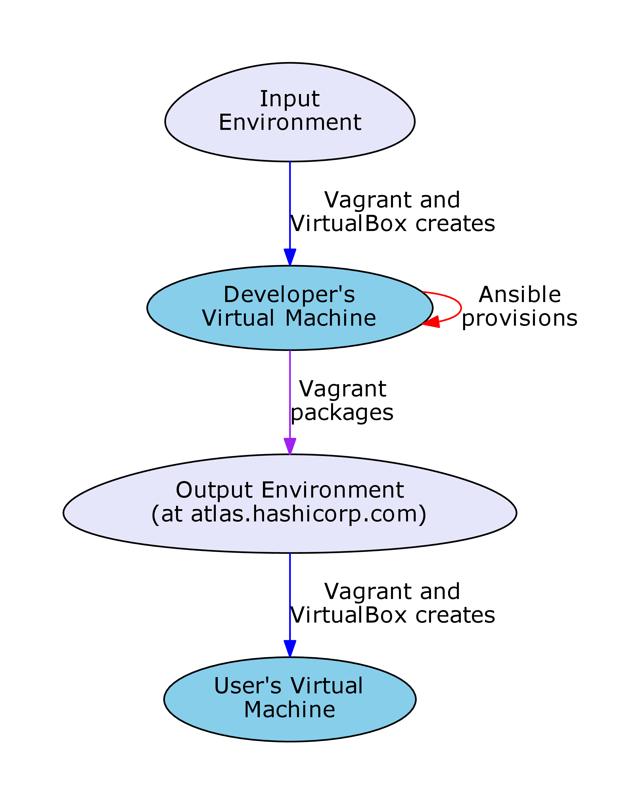

.. _dev-notes:

Developer Notes (valid for version 1.0.4)
=========================================

In :ref:`getting-started-poweruser`, we created a virtual environment from
scratch that can be shared with other users. Here, we show how you can
completely specify your own environment. Knowledge of Ansible is needed, which
can be gleaned from their excellent documentation at
http://docs.ansible.com/ansible/.

Overview: The Build and Run Processes
-------------------------------------

This graph shows the operations involved in the build and run processes.

Lets break this down:

- Input Environment -> Developer's Virtual Machine: The input environment is a
  :term:`virtual environment` containing only the operating system and few
  convenience tools. In development, Vagrant and VirtualBox create a
  :term:`virtual machine` from this environment in the ``create_vm`` role (see
  :ref:`dev-build-process`).

- Ansible Provisions: Vagrant commands Ansible to provision this machine using
  an Ansible playbook.

- Developer's Virtual Machine -> Output Environment: Vagrant then packages the
  virtual machine into a new virtual environment, which can be distributed to
  others. Tagged releases are uploaded by administrators to
  atlas.hashicorp.com, where they become available to all Vagrant users.

- Output Environment -> User's Virtual Machine: The previous steps are run in
  the build phase by a developer as the build process. This step represents the
  user following the instructions in :ref:`getting-started-user` to create a
  virtual machine for themselves, which is referred to as the run process.

The run process performed by the user has been documented in
:ref:`getting-started-user`. Here we introduce the build process, which
represents the other section of this diagram.

.. _dev-build-process:

The Build Process
~~~~~~~~~~~~~~~~~

The build (make) process in step 3 in :ref:`getting-started-poweruser` allowed
us to create a virtual environment. The Makefile in the software repository can
build multiple targets. Each target runs Ansible on the ``master.yml``
playbook, which in turn runs the ``create_vm`` role in the roles
directory. This creates a virtual machine and provisions it with the playbook
passed as a command-line argument in ``Makefile``, which lives in the jobs
directory. It will also do some post-provisioning tasks using the hookbook,
again passed as a command-line argument. The fundamental difference between the
playbook and the hookbook is that the playbook is run on the guest virtual
machine by vagrant, and the hookbook is run on the host machine. Different
Makefile targets may place different build artefacts in the artefacts
directory.

Roles add or configure software, playbooks describe the roles that must be
enacted to provision the machine, hookbooks describe what to do with that
machine (like creating a :term:`box file`), and jobs are Makefile targets that
produce certain machines.

To add a new environment, one needs to add a job that follows the pattern of
existing jobs.

Where Things Are
----------------

In order to add jobs, one should edit ``Makefile``. In order to do that, one
would need to know where things are, hence the purpose of this section. The
:term:`virtual micromagnetics` repository is structured as follows:

  - ``Makefile``: This is the Makefile through which all jobs are conducted.

  - ``ansible.cfg`` and ``inventory.txt``: These files are used by Ansible when
    the master.yml playbook is run. They contain configuration information.

  - ``roles/``: This directory contains roles (obviously). Each role is given a
    subdirectory, and should not overlap. Each role directory contains tasks,
    and may also contain the subdirectories:

    - ``vars/`` (variable definitions),
    - ``templates/`` (files to duplicate to the guest virtual machine),
    - ``meta/`` (metadata, such as role dependencies),
    - ``files/`` (files used by tasks that aren't covered by the usecases of
      templates)

  - ``jobs/``: This directory contains playbooks and directories that can be
    thought of as jobs in ``Makefile``. They are either provisioning playbooks,
    or post-provisioning hookbooks.

  - ``machines/``: This directory is created by ``Makefile``, and houses the
    vagrant environment for each individual virtual machine. The provision
    process is recorded to a log file in the machine's directory (for example,
    the provision log for the lite build job exists in
    machines/virtualmicromagnetics-lite/virtualmicromagnetics-lite.log)

  - ``artefacts/``: This directory is created by ``Makefile``, and houses build
    artefacts.

Examples
--------

.. _dev-create-machine:

Create New Machine with Existing Software
~~~~~~~~~~~~~~~~~~~~~~~~~~~~~~~~~~~~~~~~~

Lets create a custom machine called doc-example, that contains Fidimag but no X
server. Firstly, we add a target to ``Makefile`` (append the following to the ``Makefile``)::

  # This target builds a virtual hard disk file containing an OOMMF and Fidimag
  # installation.
  doc-example:
      ansible-playbook master.yml -c local -i localhost, -v -k --extra-vars="vm_name=virtualmicromagnetics-doc-example playbook=provision_virtualmicromagnetics_doc-example.yml hookbook=hook.yml extra_resources_dir=guest_resources/"

Now we need to describe what the state of the machine should be, by writing the
playbook `jobs/provision_virtualmicromagnetics_doc-examples.yml`::

  ---
  # This Ansible playbook is a provision playbook designed to be used with
  # vagrant. This playbook provisions a machine suitable for micromagnetic
  # simulation with Fidimag. It is executed by the virtual machine.

  - hosts: all

    vars:
      vm_name: virtualmicromagnetics-doc-example

    roles:
      - fidimag
      - fidimag_examples
      - add_super_user
      - { role: set_hostname, HOSTNAME: {{ vm_name }} }

Now we are ready to build the environment by commanding (again, from the
repository root directory)::

  make doc-example

This creates another :term:`virtual environment` in the artefacts directory.

Adding Software
~~~~~~~~~~~~~~~

In :ref:`dev-build-process`, we introduce roles. Roles can add new software to
a :term:`virtual environment`. By way of example, we can create a role to
install Emacs (https://www.gnu.org/software/emacs/) from the Ubuntu software
repository. We firstly create a directory structure::

  # Create a role for Emacs.
  mkdir --parents roles/emacs/tasks

Now we introduce some content using information from the Ansible documentation
(http://docs.ansible.com/ansible/, and
http://docs.ansible.com/ansible/apt_module.html). Write the following to
``roles/emacs/tasks/main.yml``::

  ---
  # This Ansible playbook installs Emacs.

  - name: Install Emacs.
    apt:
      pkg=emacs
      state=latest
      update_cache=yes
      cache_valid_time=86400
    sudo: yes

This role, when run, will ensure that the latest version of Emacs and its
dependencies are installed on the virtual machine, and updates the apt
cache. Roles can be parameterised and have dependencies, which can cause them
to become complicated. By way of example, installing Emacs on the new
doc-example environment requires us to append the line::

      - emacs

To clarify, playbook ``jobs/provision_virtualmicromagnetics_doc-examples.yml``
now looks like::

  ---
  # This Ansible playbook is a provision playbook designed to be used with
  # vagrant. This playbook provisions a machine suitable for micromagnetic
  # simulation with fidimag. It is executed by the virtual machine.

  - hosts: all

    vars:
      vm_name: virtualmicromagnetics-doc-example

    roles:
      - fidimag
      - fidimag_examples
      - add_super_user
      - { role: set_hostname, HOSTNAME: {{ vm_name }} }
      - emacs

Further Tinkering
~~~~~~~~~~~~~~~~~

We have explored how a new :term:`virtual environment` can be created, and how
new software can be added. In this section, we describe how the virtual machine
itself can be configured using Vagrant's parameters. Vagrantfiles are files
used by Vagrant written using Ruby syntax. These files specify parameters of
the :term:`virtual machine` created from a virtual environment. When running
the commands in :ref:`getting-started-user`, we create a Vagrantfile in the
working directory that describes the virtual machine to Vagrant. Vagrantfiles
can also be built into a virtual environment. Built-in Vagrantfiles can be
found in ``guest_resources/vagrantfiles``.

For example, if you wish to specify that 2048MB of memory must be used in the
virtual machine created in :ref:`dev-create-machine` [#]_, we can add a builtin
Vagrantfile at
``guest_resources/vagrantfiles/Vagrantfile_virtualmicromagnetics-doc-example_builtin``
with the following content::

  VAGRANTFILE_API_VERSION = "2"

  Vagrant.configure(VAGRANTFILE_API_VERSION) do |config|

    config.vm.provider :virtualbox do |vb|
      vb.memory = 2048
    end

This Vagrantfile will be detected by the hookbook and included automatically
when the environment is packaged. For more information on Vagrantfiles, see the
Vagrant documentation (https://www.vagrantup.com/docs/vagrantfile/).

.. [#] Note that this is not such a good idea if you want to distribute your
   environment to different users, since they may have a different amount of
   available memory to you.

Summary and Final Words
-----------------------

To summarise, :term:`virtual environment`\s are created from an empty Ubuntu
virtual machine after being provisioned and packaged. This build process allows
the user to create a Virtual Micromagnetics :term:`virtual machine` using
Vagrant and VirtualBox. We have also presented how a new environment can be
created, how the software of that environment can be controlled, and how the
virtual machines can be parameterised.

Thank you for using Virtual Micromagnetics! If you create roles for your
favourite software, consider sharing them with the community. You can create a
pull request at our GitHub repository at
https://github.com/computationalmodelling/virtualmicromagnetics, or
contacting Mark at mark[dot]vousden[at]soton[dot]ac[dot]uk.
