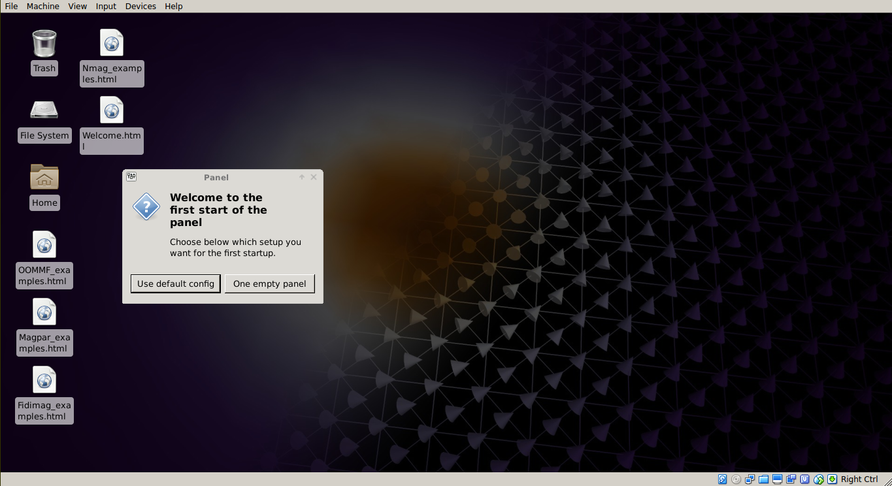
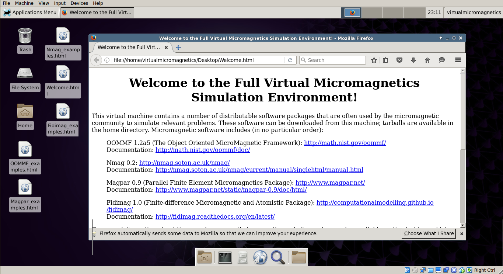

.. _getting-started-user:

Getting Started: As a User
==========================

Virtual Machines
----------------

To start a :term:`Virtual Micromagnetics` environment, you will need the
following software:

- VirtualBox >= 5.0 (https://www.virtualbox.org/wiki/downloads)
- Vagrant >= 1.7.4 (https://www.vagrantup.com/downloads)

After restarting your machine, command the following in an empty directory::

 vagrant init virtualmicromagnetics/full
 vagrant up --provider virtualbox

These commands will download the Full Virtual Micromagnetics environment from
the Internet to your computer, and load the environment automatically. When
complete, you should be greeted with this window:

This is output from a :term:`virtual machine` running on your computer! Virtual
machines produced in this way run Ubuntu GNU/Linux (https://www.ubuntu.com)
with the XFCE window manager. From here, you can follow instructions in the
welcome file on the desktop to run simulations with the installed
packages. Never worry about software dependencies again!

Next, see :ref:`environments` for the environments that are available besides
the Full Virtual Micromagnetics environment, and the software on these
environments, or you can read on to learn about :term:`container`
virtualisation.

Containers
----------

:term:`Container`\s are an alternative virtualization technology to virtual
machines. To start :term:`Virtual Micromagnetics` containers, you will need:

- Docker >= 1.6.2 (https://docs.docker.com/engine/installation/)

Your user will need to be in the docker group on the machine you are running on
[#]_. After restarting your machine, command the following in an empty
directory::

 docker run -ti virtualmicromagnetics/lite:1.1.0 /bin/bash -l

This command will download the Full Virtual Micromagnetics container image from
the Internet to your computer, and start bash in your shell.

Now take a look at :ref:`environments` for the environments that are available
besides the Full Virtual Micromagnetics environment.

.. [#] Note that the docker group is root-equivalent, so you will likely need
   to own the machine to use Virtual Micromagnetics containers. To avoid this,
   consider using a different provider that does not require root privileges,
   but beware, as Docker is the only container provider supported at present.
